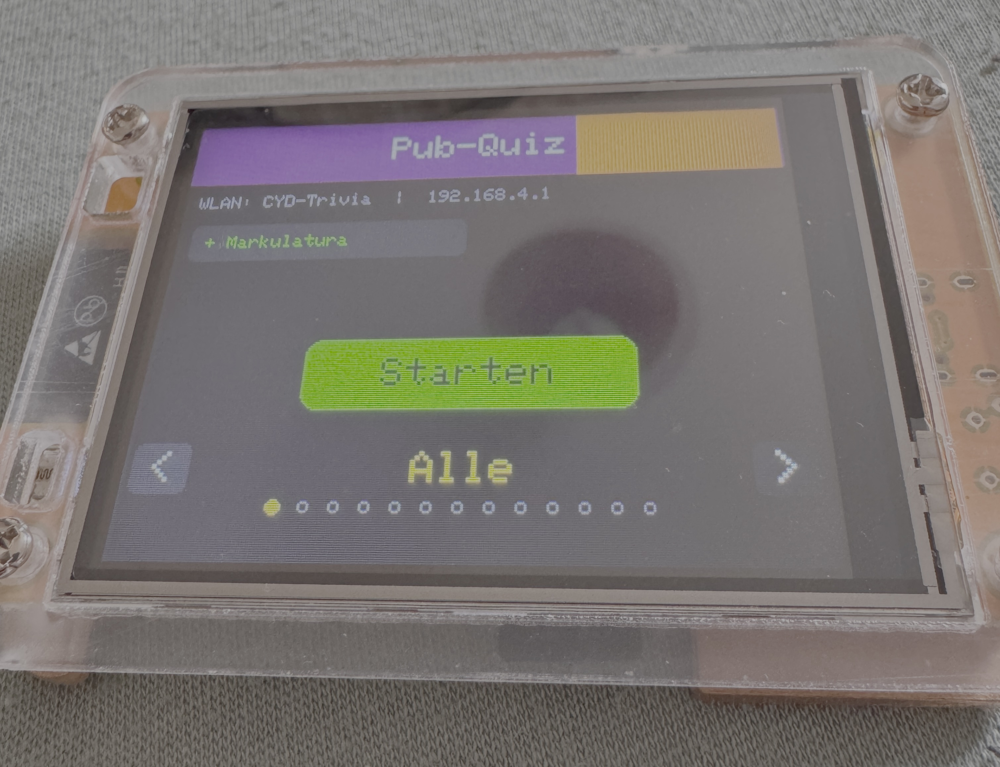
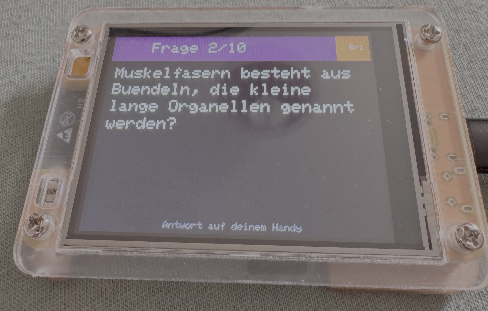
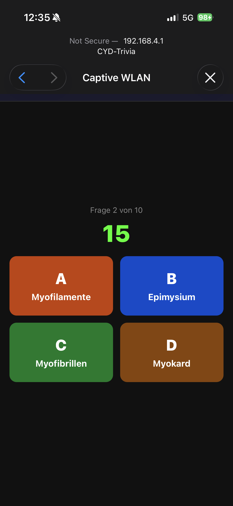

# CYD Pub-Quiz Trivia

A multiplayer pub-quiz trivia game running entirely on an **ESP32-2432S028 (Cheap Yellow Display)** — no internet connection required during gameplay. Players connect via Wi-Fi and answer questions on their smartphones while the current question is shown on the display.

> **Note:** UI and all example questions are in German. Sorry about that — they were sourced from [opentrivia.de/api](https://opentrivia.de/api) and manually embedded into the sketch to keep the game fully offline.

> **Disclaimer:** This project was entirely vibe-coded with the help of AI (Claude Sonnet 4.6). It works,  but there are probably bugs, edge cases, and questionable decisions throughout.

## Screenshots
<table>
  <tr>
    <td></td>
    <td></td>
    <td></td>
  </tr>
</table>

---

## Features

- **Fully offline** — the ESP32 acts as its own Wi-Fi access point
- **Up to 8 players** simultaneously
- **354 questions** across 12 categories, selectable on the display before the game starts
- **10 random questions** per round, reshuffled every game
- **Captive portal** — players can join and play directly from the iOS/Android "Join Wi-Fi" dialog without opening a browser
- **Category selector** on the display: swipe through categories with left/right arrow buttons
- **Round results** shown on both the display and each player's phone
- **Play again** without reconnecting — players stay connected between rounds

---

## Hardware

| Component | Details |
|-----------|---------|
| Board | ESP32-2432S028 ("Cheap Yellow Display") |
| Display | ILI9341, 2.8" 240×320 TFT, landscape mode |
| Touch | XPT2046 resistive touchscreen |
| Wi-Fi | ESP32 built-in (access point mode) |

---

## Dependencies

Install via Arduino IDE **Library Manager**:

- `TFT_eSPI` by Bodmer
- `XPT2046_Touchscreen` by Paul Stoffregen

The following are part of the ESP32 Arduino core (no separate install needed):

- `WiFi`
- `WebServer`
- `DNSServer`

---

## Setup

### 1. Board setup

Add the ESP32 board package to Arduino IDE if you haven't already:

```
https://raw.githubusercontent.com/espressif/arduino-esp32/gh-pages/package_esp32_index.json
```

In **Boards Manager**, install **esp32 by Espressif Systems**.

### 2. TFT_eSPI configuration

Edit `Arduino/libraries/TFT_eSPI/User_Setup.h` with the correct CYD pin definitions:

```cpp
#define ILI9341_DRIVER

#define TFT_BL   21
#define TFT_BACKLIGHT_ON HIGH

#define TFT_MISO 12
#define TFT_MOSI 13
#define TFT_SCLK 14
#define TFT_CS   15
#define TFT_DC    2
#define TFT_RST  -1

#define TOUCH_CS 33

#define SPI_FREQUENCY       55000000
#define SPI_READ_FREQUENCY  20000000
#define SPI_TOUCH_FREQUENCY  2500000
```

### 3. Upload

Select **ESP32 Dev Module** as the board, set **Upload Speed** to `115200`, and upload the sketch.

---

## How to play

1. Power on the CYD — it creates a Wi-Fi network called **`CYD-Trivia`**
2. Players connect their phones to `CYD-Trivia` — the game page opens automatically in the captive portal dialog (no browser needed on iOS or Android)
3. Each player enters their name and joins
4. The host selects a category on the display using the `<` / `>` arrows
5. The host starts the game by tapping **Starten** on the display
6. Each question is shown on the display — players answer A/B/C/D on their phones within 20 seconds
7. After all rounds, the leaderboard is shown on the display and each player's phone

---

## Categories

Select a category before starting. The display cycles through:

| # | Category | Questions |
|---|----------|-----------|
| 0 | **All** (random mix) | 354 |
| 1 | Entertainment | 50 |
| 2 | Science | 44 |
| 3 | Science & Nature | 44 |
| 4 | History | 44 |
| 5 | Geography | 47 |
| 6 | Vehicles | 11 |
| 7 | Sport | 27 |
| 8 | Celebrities | 13 |
| 9 | Animals | 12 |
| 10 | General Knowledge | 47 |
| 11 | Mythology | 8 |
| 12 | Politics | 7 |

Questions were sourced from [opentrivia.de/api](https://opentrivia.de/api) and manually cleaned and embedded into the sketch so the game runs fully offline. Duplicates were automatically removed during import.

---

## Adding your own questions

Questions are defined as C++ structs at the top of the sketch. Each category has its own array:

```cpp
const Question questions_Sport[NUM_Q_SPORT] = {
  {"How many players are on a basketball team?", {"4", "5", "6", "7"}, 1},
  //  ^-- question text                           ^-- 4 answers        ^-- index of correct answer (0-3)
};
```

To add a new category:
1. Add a new `const Question questions_YourCat[]` array
2. Add an entry to `CAT_QUESTIONS[]`, `CAT_SIZES[]`, and `CATEGORY_NAMES[]`
3. Increment `NUM_CATEGORIES`

---

## Project structure

```
CYDTrivia.ino       — Main sketch (single file)
README.md           — This file
```

---

## License

MIT — do whatever you want with it.

---

## Credits

- Questions: [opentrivia.de](https://opentrivia.de) (German language, manually embedded)
- Built for the ESP32-2432S028 ("Cheap Yellow Display") community
